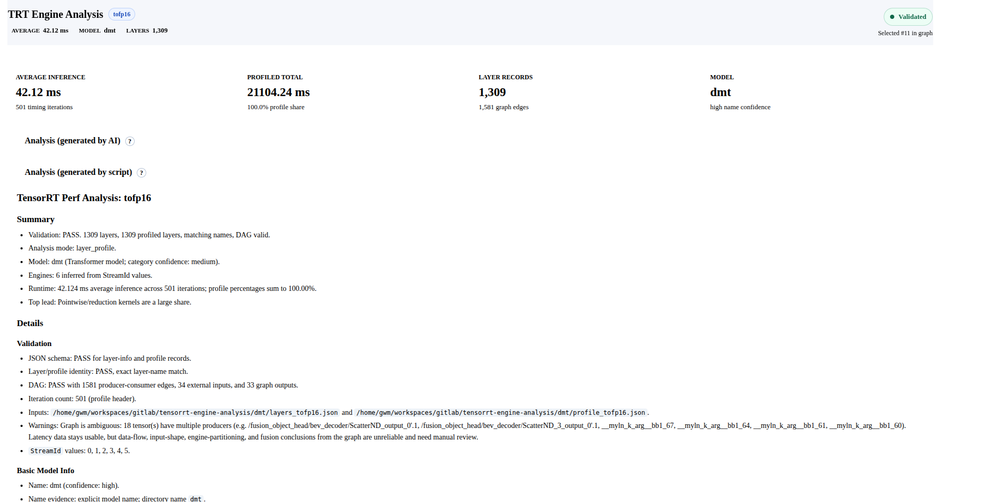
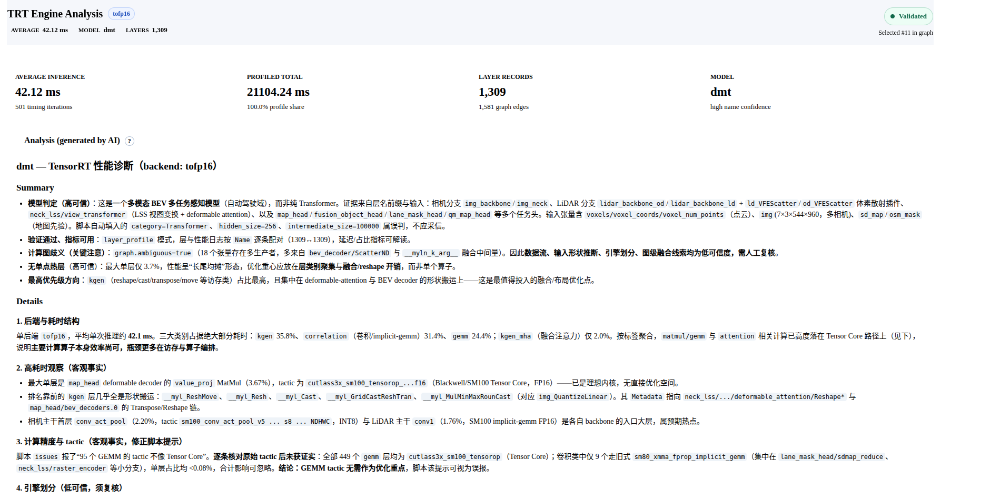
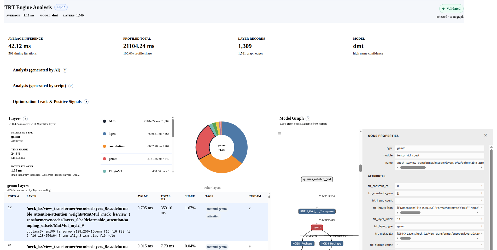

# TRT engine analysis  

## Overview   







## GetStart 
TBD  

## Workflow 

● I'll run the analysis workflow on the available input. Let me start with the deterministic analysis step.

● The files are now named layers_.json/profile_.json, which packaging accepts. Let me run the deterministic analysis.

● Exit 0. Now let me check the validation object and understand the model before writing the diagnosis.

● Validation passed, layer_profile mode. Let me run the format validation, then explore the perf data.

> ● This is clearly an AEB (Automatic Emergency Braking) BEV perception model — 7-camera input (img 7×3×544×960), pillar/point-cloud features (coors, num_pillar, features), temporal fusion (t_temp2cur,
  cached_*), sparse detection heads (sparse_cls/qt/reg). Let me examine the hot layers, type breakdown, and script-detected issues.

● Now let me examine the dominant Myelin node and the shape/cast/dynamic-tagged layers to understand the hotspot.

> ● The 46.8% "shape/cast/dynamic" is essentially one giant Myelin fusion region (/neck/upscale.1…/bev_decoder/Slice_22) at 46.48% plus its I/O reformat copies. Let me understand the CNN backbone structure
  and confirm the count issue on the profile total.

● I have a full picture. Now let me package the report, then write the AI diagnosis.

● Now I'll write the AI diagnosis analyze.md, then attach it to the report.

● Now attach the analyze.md to the report via the repackage path.

● Analysis complete. Here's the summary.

## Output   

  report location：tmp/report_aeb/（include analyze-data.json、analyze.md and web）

+ 核心发现   
  ```
    ┌──────────────┬───────────────────────────────────────────────────────────────────────────────────┐
    │      项      │                                        值                                         │
    ├──────────────┼───────────────────────────────────────────────────────────────────────────────────┤
    │ 平均单次推理 │ 18.51 ms                                                                          │
    ├──────────────┼───────────────────────────────────────────────────────────────────────────────────┤
    │ 单一热点     │ 1 个 Myelin 融合块 {ForeignNode[/neck/upscale.1 … /bev_decoder/Slice_22]} = 46.5% │
    ├──────────────┼───────────────────────────────────────────────────────────────────────────────────┤
    │ 主干         │ ResNet 风格 layer1~4 ≈ 40%，已良好融合，无单点热点                                │
    ├──────────────┼───────────────────────────────────────────────────────────────────────────────────┤
    │ 引擎         │ 单引擎（StreamId=0），83 个 Cask 卷积中 82 个带 tactic                            │
    └──────────────┴───────────────────────────────────────────────────────────────────────────────────┘
  ```

+ 关键判断（修正了脚本的自动分类）：  
  1. 这不是普通 CNN，而是 AEB/BEV 多模态感知网络——7 路环视相机（img 7×3×544×960）+ 点云 pillar 分支 + 时序融合 + 稀疏检测头（sparse_cls/qt/reg）。  

  2. 前端聚合显示的「46.8% shape/cast/dynamic」其实几乎就是那一个 Myelin 块，其余 9 个同标签层只是它的 I/O reformat 拷贝——不是分散的动态 shape 开销。优化应集中在这一个融合块（拆解分析 + 消除边界
  reformat），主干不值得单独调优。

+ 预览网页报告： http://127.0.0.1:8765/


